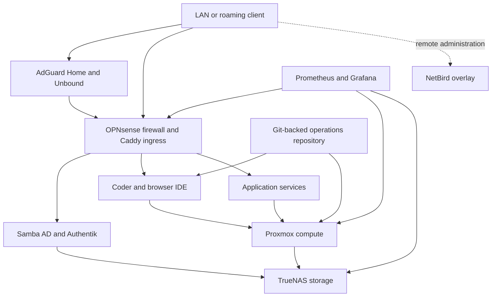

# Architecture

The homelab is organized around platform roles rather than a list of machines.
That keeps the design understandable when workloads move between virtualization
hosts or are temporarily rebuilt elsewhere.



## Platform Layers

| Layer | Technology | Responsibility |
| --- | --- | --- |
| Virtualization | Proxmox VE | Workload isolation, migration, snapshots, and recovery placement |
| Network edge | OPNsense and Caddy | Routing, firewall policy, TLS termination, and reverse proxying |
| Name resolution | AdGuard Home and Unbound | Filtering, client policy, local overrides, and recursive resolution |
| Directory identity | Samba AD | Domain users, groups, Kerberos, and SMB identity |
| Web identity | Authentik | OIDC, proxy authorization, passkeys, and application policy |
| Overlay access | NetBird | Routed remote administration without exposing every service publicly |
| Storage | TrueNAS | Datasets, SMB, application data, snapshots, and backup boundaries |
| Private cloud | Nextcloud | Files, calendars, contacts, and sync on top of self-hosted storage |
| Developer platform | Coder and browser IDEs | Persistent, centrally managed workspaces reachable from a browser |
| Observability | Prometheus and Grafana | Metrics, dashboards, alerting, and cross-layer failure correlation |
| Operations | Git and automated validation | Runbooks, configuration, handoffs, tests, and durable reasoning |

## Request Paths

Local and remote traffic intentionally take different routes while keeping the
same service names:

```text
LAN client     -> local DNS answer -> Caddy/local service path
Roaming client -> public DNS       -> public ingress -> Caddy/service path
Admin client   -> NetBird overlay  -> management endpoint
```

This avoids sending local traffic through public ingress and avoids teaching
every roaming client a private resolver configuration.

For protected web applications, the common path is:

```text
client -> Caddy -> Authentik forward-auth -> application
```

The reverse proxy handles TLS and routing. Authentik handles authentication and
authorization. The application remains responsible for application-level
permissions when it has its own role model.

## Failure Domains

The design separates failure domains deliberately:

- Losing public ingress must not stop LAN access.
- Losing the overlay must not stop ordinary router and DNS behavior.
- Losing the web identity provider must not remove hypervisor break-glass
  access.
- Losing a compute node must not destroy the only copy of application data.
- Losing the private Git service must not erase operating knowledge.
- A healthy daemon is not accepted as proof that the browser-facing path works.

## Design Principles

1. Keep the private control repository as the operational source of truth.
2. Treat dependency order as part of the architecture, not an incident-time
   discovery exercise.
3. Prefer reproducible configuration and executable validation over manual
   state.
4. Keep remote access layered on top of a working local network.
5. Keep identity centralized without making it the only break-glass path.
6. Test from a real client after testing the service locally.
7. Publish useful patterns while withholding environment-specific access data.

## Recovery Order

The default recovery sequence is:

1. network and name resolution;
2. storage availability;
3. directory and web identity;
4. ingress and certificates;
5. compute workloads;
6. application health;
7. observability;
8. client-path validation.

The included [recovery plan](../examples/recovery-plan.json) expresses these
dependencies as data and can be checked for missing dependencies or cycles.
